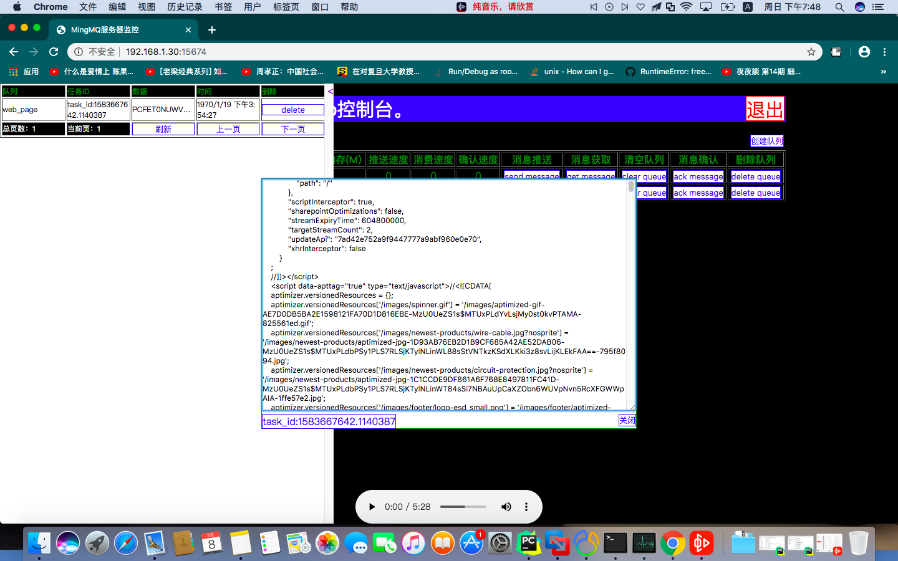

.. MingMQ documentation master file, created by
   sphinx=quickstart on Thu Mar 12 05:53:04 2020.
   You can adapt this file completely to your liking, but it should at least
   contain the root `toctree` directive.

MingMQ文档
==================================

一个跨平台MQ消息服务，支持和RabbitMQ服务器的大多数功能。

Install
---------

::

   pip3 install mingmq

Server
--------

::

   $ mmserver ==help
   usage: 欢迎使用MingMQ消息队列服务器。 [=h] [==CONFIG_REUSE CONFIG_REUSE] [==HOST HOST] [==PORT PORT] [==MAX_CONN MAX_CONN] [==USER_NAME USER_NAME] [==PASSWD PASSWD] [==TIMEOUT TIMEOUT]
                             [==ACK_PROCESS_DB_FILE ACK_PROCESS_DB_FILE] [==COMPLETELY_PERSISTENT_PROCESS_DB_FILE COMPLETELY_PERSISTENT_PROCESS_DB_FILE]

   optional arguments:
     =h, ==help            show this help message and exit
     ==CONFIG_REUSE CONFIG_REUSE
                           是否读取配置文件来启动服务：0为不读取，1为读取，1则使用默认配置文件路径/etc/mingmq_config，该路径不允许修改。
     ==HOST HOST           输入服务器IP地址：: 默认，0.0.0.0
     ==PORT PORT           输入服务器端口：默认，15673
     ==MAX_CONN MAX_CONN   输入服务器的最大并发数，默认，100
     ==USER_NAME USER_NAME
                           输入服务器账号，默认，mingmq
     ==PASSWD PASSWD       输入服务器密码，默认，mm5201314
     ==TIMEOUT TIMEOUT     输入服务器超时时间（仅linux下有效），默认，10
     ==ACK_PROCESS_DB_FILE ACK_PROCESS_DB_FILE
                           输入服务器确认消息文件名
     ==COMPLETELY_PERSISTENT_PROCESS_DB_FILE COMPLETELY_PERSISTENT_PROCESS_DB_FILE
                           输入服务器确认消息文件名

   $ mmserver
   正在启动，服务器的配置为
   IP/端口:0.0.0.0:15673, 用户名/密码:mingmq/mm5201314，最大并发数:100，超时时间: 10

默认端口15673。

Web Console
---------------

启动mmserver监控WEB控制台：

::

   $ mmweb

默认端口15674。

Client
----------

Hello, World!
:::::::::::::::

::

   """
   客户端启动测试
   """
   import logging, time
   from threading import Thread, active_count

   from mingmq.client import Client

   logging.basicConfig(level=logging.ERROR)

   def init_cli(first, queue_name):
       """
       客户端测试
       """
       client = Client('192.168.1.30', 15673)

       client.login('mingmq', 'mm5201314')

       print('登录成功')
       if first:
           client.declare_queue(queue_name)

       return client

   def send(client, queue_name, data):
       client.send_data_to_queue(queue_name, data)
       print('发送任务成功')

   def get(client, queue_name):
       message_data = client.get_data_from_queue(queue_name)

       print('获取任务成功', message_data)

       json_obj = message_data['json_obj']
       message_id = None
       if len(json_obj) != 0:
           message_id = json_obj[0]['message_id']

       if message_id:
           print('消息确认成功', client.ack_message(queue_name, message_id))

   def close(client):
       client.logout('mingmq', 'mm5201314')
       print('退出成功')
       client.close()
       print('关闭成功')

   def main(tsn, queue_name, data):
       clis = []

       for i in range(tsn):
           if i == 0:
               clis.append(init_cli(True, queue_name))
           else:
               clis.append(init_cli(False, queue_name))

       i = 0
       ts = []
       while i < len(clis):
           t = Thread(target=send, args=(clis[i], queue_name, data))
           t.start()
           ts.append(t)
           i += 1

       for t in ts: t.join()

       i = 0
       ts = []
       while i < len(clis):
           t = Thread(target=get, args=(clis[i], queue_name))
           t.start()
           ts.append(t)
           i += 1

       for t in ts: t.join()

       for cli in clis:
           close(cli)

   tsn = 1000
   queue_names = ['word']
   datas = ['hello teacher']

   main(tsn, queue_names[0], datas[0])

Future
---------

* 需要开发一些测试，并生成测试数据图片，用以在readme页面进行展示，用来吸引更多的用户；
* 需要编写一定的rst文档，编写之前需要去询问一下tornado或者借鉴一下他们rst文档是怎么快速生成的方法；
* 需要进行内存优化，省掉不必要的内存开销；
* 需要对api进行优化，需要寻找一种方式去搞定flask app与uswgi 零依赖的运行方式，或许有替代uswgi的方案；
* Linux下等内存和Mac下的内存不一致，同样的任务放在虚拟机中的比mac真是机器中所占用的内存要多，我实验的Linux发行版为Ubuntu 19 server，可能需要在这方面去探索下造成这个差距的原因；
* gevent运行flask app在mac下会报错，但是在linux下却是可以的；
* 我再考虑要不要将其做成一个key,value的数据库，但是又想了下mongodb，redis本来就已经存在等软件，我为什么要去做呢？而且这些软件本来就很完美，并没有什么缺陷；

More
-------

* https://www.rabbitmq.com/

.. toctree::
   :maxdepth: 2
   :caption: Contents:

索引和表格
------------

* :ref:`genindex`
* :ref:`modindex`
* :ref:`search`